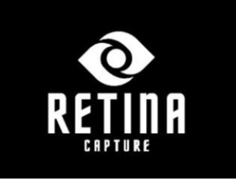
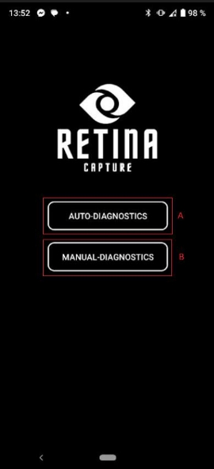
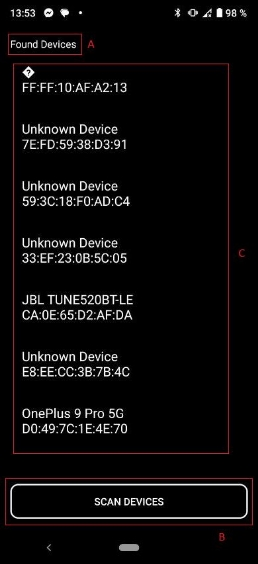
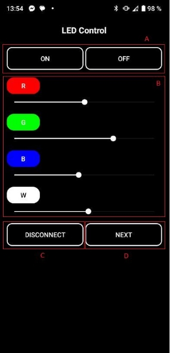
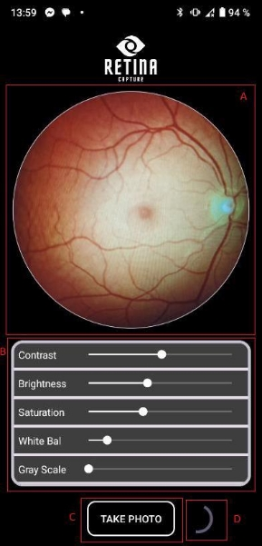
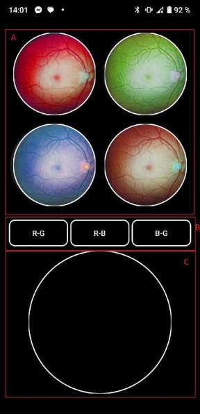
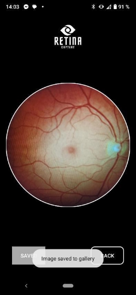
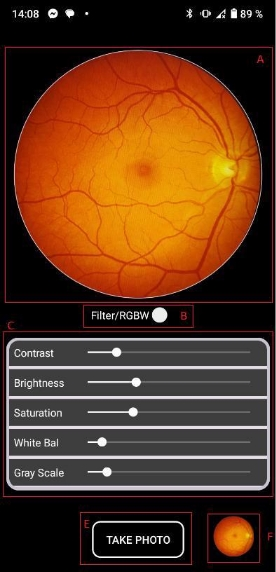
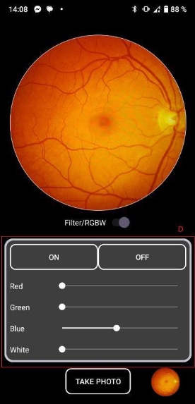

<h1 style="text-align: center;">
    Development of a Mobile Interface for Processing Ophthalmic Images
</h1>

&nbsp

###

<h3 style="text-align: center;">Main Screen</h3>

    
    

        Main screen of the RetinaCapture app with buttons for selecting the diagnostic mode: Auto-diagnostics (A) and Manual-diagnostics (B). By pressing one of these buttons, we navigate to the Bluetooth device selection screen.
    

###

<h3 style="text-align: center;">Bluetooth Device Selection Screen</h3>

    

        
- <strong>The text element "Found Devices"</strong> (A) displays a list of found devices.

        
- <strong>The button "Scan Devices"</strong> (B) initiates the scanning process to detect available Bluetooth devices.

        
- <strong>The device list</strong> (C) displays the names and addresses of found devices, allowing the user to select a device for connection.

    

    

###

<h3 style="text-align: center;">LED Check Screen</h3>

    
    

        
- <strong>Buttons "ON" and "OFF"</strong> (А) for turning the LEDs on and off, respectively.

        
- <strong>Slider "R"</strong> for checking the intensity of the red color.

        
- <strong>Slider "G"</strong> for checking the intensity of the green color.

        
- <strong>Slider "B"</strong> for checking the intensity of the blue color.

        
- <strong>Slider "W"</strong> for checking the intensity of the white color.

        
- <strong>Button "Disconnect"</strong> (С) for disconnecting from the Bluetooth device.

        
- <strong>Button "Next"</strong> (D) for proceeding to the next diagnostic screen.

    

###

<h3 style="text-align: center;">Quick Diagnostics Screen</h3>

    

        
- <strong>The circular image preview</strong> (A) is located below the logo and shows in real-time what the camera is capturing.

        
- <strong>A card with sliders</strong> (B) is located below the preview and allows adjustment of image parameters such as contrast, brightness, saturation, white balance, and grayscale.

        
- <strong>The photo capture button</strong> (C) is located at the bottom of the screen for capturing the image.

        
- <strong>The Progress Bar</strong> (D) is displayed during the image capture to indicate progress.

    

    

###

<h3 style="text-align: center;">Image Results Screen</h3>

    
    

        
- <strong>Four image previews</strong> (A) display the captured images under the red, green, blue, and white LEDs.

        
- <strong>Image processing buttons</strong> (B) allow the user to perform matrix subtraction between different image channels for analysis:

        <ul>
            <li>"R-G" to subtract the red channel from the green channel.</li>
            <li>"R-B" to subtract the red channel from the blue channel.</li>
            <li>"B-G" to subtract the blue channel from the green channel.</li>
        </ul>
        
- <strong>The resulting image</strong> (C) displays the outcome of the image processing after pressing one of the processing buttons.

    

###

<h3 style="text-align: center;">Save to Gallery</h3>

    

        
This screen allows users to view captured images in fullscreen mode and save them for further use or analysis. After pressing the "Save" button, the image is stored in the "DCIM/RC_AutoDiagnosis" folder in the device's gallery.

    

    

###

<h3 style="text-align: center;">Manual Diagnostics Screen</h3>

    

        
        
    

    

        
- <strong>The circular image preview</strong> (A) shows real-time footage from the camera for framing adjustments.

        
- <strong>The "Filter/RGBW" mode switch</strong> (B) allows toggling between filter modes and RGBW modes.

        
- <strong>The filter sliders card</strong> (C) for adjusting contrast, brightness, saturation, white balance, and grayscale.

        
- <strong>The RGBW sliders card</strong> (D) for adjusting the intensity of RGBW LEDs.

        
- <strong>The "Take Photo" button</strong> (E) for capturing the image.

        
- <strong>The image preview</strong> (F) allows viewing the image in fullscreen mode with an option to save it to the gallery.

    

